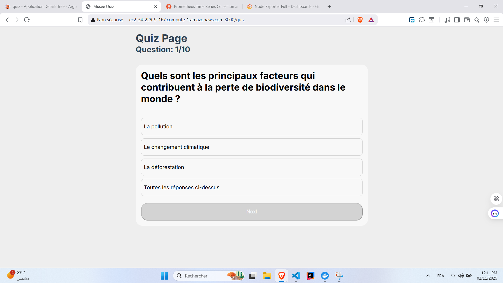
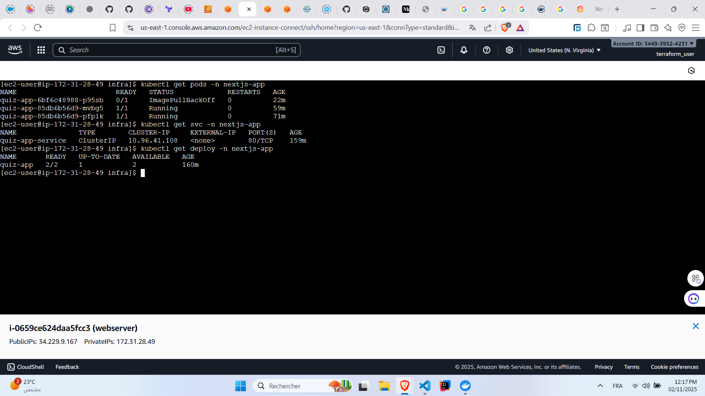
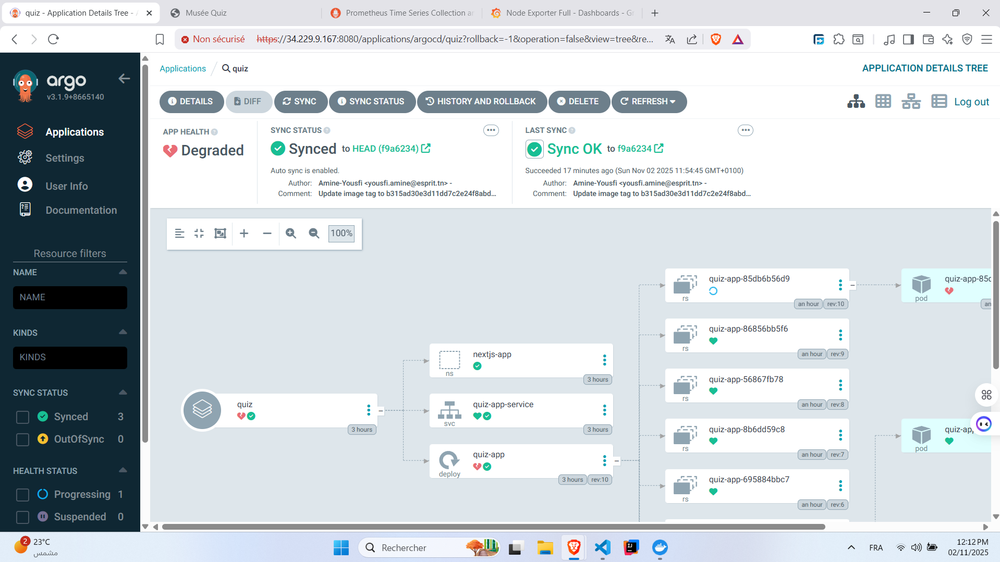
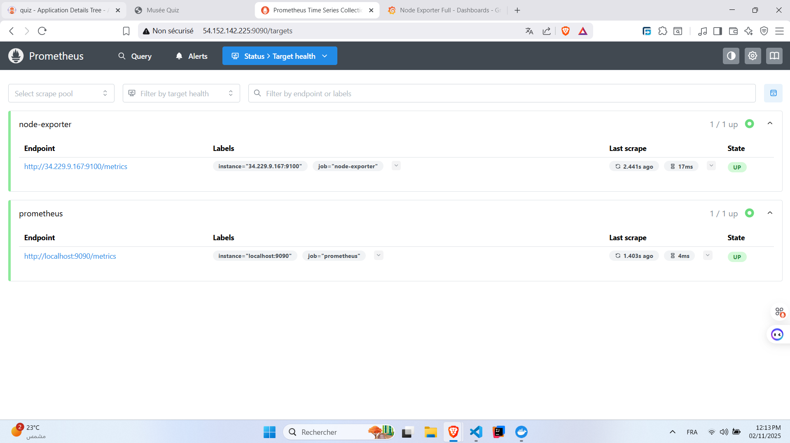
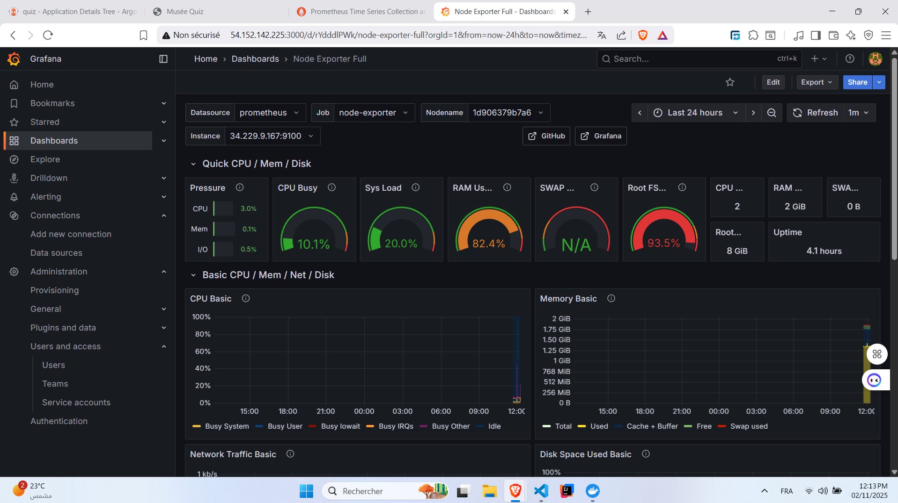
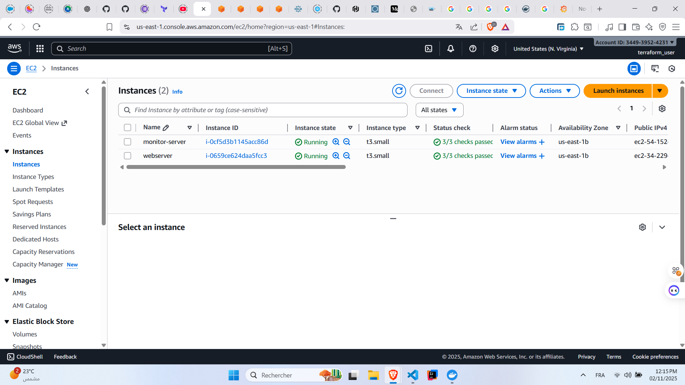

# Quiz Application

A modern Next.js quiz application with Docker containerization, Kubernetes deployment using kind, ArgoCD for GitOps, and comprehensive monitoring with Prometheus and Grafana.

## 🚀 Live Application

**Access the app:** [http://ec2-34-229-9-167.compute-1.amazonaws.com:3000/quiz](http://ec2-34-229-9-167.compute-1.amazonaws.com:3000/quiz)

## 📋 Table of Contents

- [Overview](#overview)
- [Tech Stack](#tech-stack)
- [Folder Structure](#folder-structure)
- [Screenshots](#screenshots)
- [CI/CD Pipeline](#cicd-pipeline)

## 🎯 Overview

This project demonstrates a complete DevOps pipeline for a Next.js quiz application, including:
- Containerization with Docker
- Kubernetes orchestration using kind
- GitOps deployment with ArgoCD
- Automated CI/CD with GitHub Actions
- Infrastructure monitoring with Prometheus and Grafana
- AWS EC2 hosting

## 🛠️ Tech Stack

**Frontend & Backend:**
- Next.js 15.x
- React 19.x
- TypeScript
- Node.js 20.x

**DevOps & Infrastructure:**
- Docker & Docker Compose
- Kubernetes (kind)
- ArgoCD
- GitHub Actions
- Terraform
- Ansible
- Shell Script

**Monitoring:**
- Prometheus
- Grafana
- Node Exporter

**Cloud Provider:**
- AWS EC2 (t3.small instances)

## 📁 Folder Structure

```
quiz/
├── .github/
│   └── workflows/
│       └── ci-cd.yml           # GitHub Actions CI/CD pipeline
├── app/                        # Next.js app directory
│   ├── quiz/
│   │   └── page.tsx           # Quiz page component
│   └── layout.tsx             # Root layout
├── infra/                     # Infrastructure as Code
│   ├── ansible/               # Ansible playbooks
│   └── terraform/             # Terraform configurations
├── k8s/                       # Kubernetes manifests
│   ├── deployment.yaml        # Application deployment
│   ├── service.yaml           # Service configuration
│   └── namespace.yaml         # Namespace definition
├── public/                    # Static assets
├── node_modules/              # NPM dependencies
├── .dockerignore             # Docker ignore file
├── .eslintrc.json            # ESLint configuration
├── .gitignore                # Git ignore file
├── docker-compose.yaml       # Docker Compose for monitoring stack
├── Dockerfile                # Application container definition
├── eslint.config.mjs         # ESLint module configuration
├── jsconfig.json             # JavaScript configuration
├── next.config.js            # Next.js configuration
├── package.json              # NPM package manifest
├── package-lock.json         # NPM lock file
└── README.md                 # Project documentation
```

## 📸 Screenshots

### Application Running

*The quiz application displaying questions in French with multiple choice answers*

### Kubernetes Cluster

*Application pods running in the nextjs-app namespace with replica sets*

### ArgoCD Dashboard

*ArgoCD showing the synchronized quiz application with deployment status*

### Prometheus Targets

*Prometheus monitoring targets including node-exporter and prometheus itself*

### Grafana Dashboard

*Grafana dashboard (ID: 1860) displaying system metrics: CPU, Memory, Disk, Network*

### AWS EC2 Instances

*Two EC2 instances running: webserver (application) and monitor-server (monitoring stack)*

## 🔄 CI/CD Pipeline

The GitHub Actions workflow automates the entire deployment process:

### Workflow Stages

| Stage | Description |
|-------|-------------|
| **Checkout Source Code** | Clones the repository with full history for git operations |
| **Set up Node.js** | Configures Node.js 20.x environment for building the application |
| **Install Dependencies** | Installs NPM packages using `npm ci` for consistent builds |
| **ESLint Check** | Runs code linting to ensure code quality and standards |
| **Docker Login** | Authenticates with Docker Hub using stored credentials |
| **Docker Build and Push** | Builds the Docker image and pushes with commit SHA and latest tags |
| **Update Kubernetes Deployment** | Uses `sed` to update the image tag in k8s/deployment.yaml |
| **Commit and Push Updated Deployment** | Commits the updated manifest back to the repository with `[skip ci]` tag |

### Workflow Trigger

- **Event**: Push to `main` branch
- **Skip Conditions**: Automatically skips if commit message contains `[skip ci]` or `Update image tag` to prevent infinite loops

### Pipeline Flow

```
Code Push → GitHub Actions → Install Dependencies → ESLint Check → Docker Login → Docker Build and Push → Update K8s Manifest → Commit and Push Updated Deployment → ArgoCD Sync → Deploy to Kubernetes
```
## 👤 Author

**Amine Yousfi**
- GitHub: [Amine Yousfi](https://github.com/Amine-Yousfi)
- Email: yousfi.amine@esprit.tn

---

**Made with ❤️ by Amine Yousfi** 